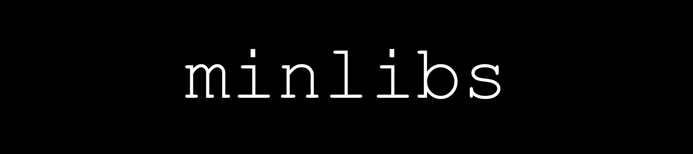

# array
[array](https://github.com/nkhatsko/test/tree/master/array) - my std::array implementation

# string
[string](https://github.com/nkhatsko/test/tree/master/string) - my std::string implementation